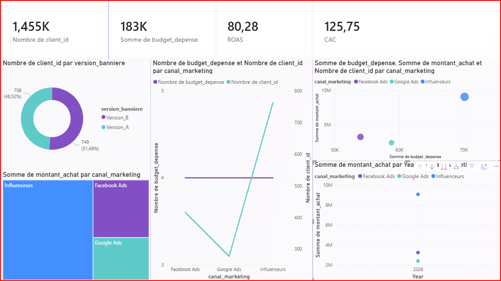

# Advanced Marketing Campaigns Analytics Dashboard (Power BI)

## Project Overview

This project delivers an interactive and intelligent business analytics dashboard built using **Power BI Desktop**. It integrates marketing spend data with customer conversion metrics to evaluate the performance of different acquisition channels (Facebook Ads, Google Ads, and Influencers) and perform fine-grained A/B testing analysis on creative banners.

## Key Business Insights

- **Influencers RoI:** Influencers are the most lucrative channel, generating the highest Revenue (Chiffre d'Affaires) and Peak Conversions with an optimized budget.
- **Google Ads Underperformance:** Despite receiving equal budget distribution, Google Ads significantly underperformed with the lowest customer acquisition volume.
- **A/B Banner Test:** `Version_B` slightly outperforms `Version_A` (51.48% vs 48.52% of total conversions), providing guidance for future creative assets.

## Dashboard Preview

## Advanced Features & DAX Measures Built

- **Data Modeling:** Established automated 1-to-many structural relationships between spend records and customer conversion datasets.
- **Advanced KPIs:** Engineered custom DAX metrics for deep business tracking:
  - **ROAS (Return on Ad Spend):** `ROAS = DIVIDE(SUM(customer_conversions[montant_achat]); SUM(marketing_spend[budget_depense]))`
  - **CAC (Customer Acquisition Cost):** `CAC = DIVIDE(SUM(marketing_spend[budget_depense]); COUNT(customer_conversions[client_id]))`
- **Interactive Visuals:** Built a high-level **Scatter Chart (Nuage de points)** for strategic performance positioning alongside cross-filtering matrices and trend analysis over time.

## Repository Structure

- `Dashboard_Marketing.pbix` - Core Power BI Desktop project file.
- `marketing_spend.csv` - Detailed marketing budget allocation by campaign and channel.
- `customer_conversions.csv` - Granular customer transactions, purchase amounts, and banner versions.

Explication Détaillée des Visuels (image_3ba710.png)
Les Principaux KPIs (Cartes Supérieures)
Nombre de client_id (1,455K) : Représente le volume total de conversions uniques générées sur l'ensemble des campagnes marketing (soit exactement 1 455 conversions validées).

Somme de budget_depense (183K) : Indique l'enveloppe budgétaire totale investie et répartie sur les trois canaux d'acquisition.

ROAS (80.28) : Un indicateur clé d'efficacité (Return on Ad Spend). Un score global aussi élevé démontre une excellente rentabilité financière brute, portée majoritairement par la performance exceptionnelle du canal des influenceurs.

CAC (125.75) : Le Coût d'Acquisition Client moyen. Il indique qu'en moyenne, l'entreprise a dépensé 125,75 DH (ou unité monétaire) pour acquérir chaque nouveau client converti.

Graphique en Anneau (A/B Testing des Bannières)
Description : Visualise la répartition des conversions selon la version de la bannière publicitaire utilisée.

Insight Business : Les performances des deux créations sont extrêmement serrées. La Version_B est légèrement en tête avec 51,48% (749 conversions) contre 48,52% (706 conversions) pour la Version_A. Les deux variantes sont globalement validées et performantes.

Le Treemap (Volume d'Achat par Canal)
Description : Représente graphiquement le poids de chaque canal marketing dans le Chiffre d'Affaires total généré.

Insight Business : Le grand bloc bleu met en évidence la domination incontestable des Influenceurs comme principal moteur de revenus. Facebook Ads occupe une position secondaire intermédiaire, tandis que Google Ads montre une contribution marginale très faible.

Graphique Combiné Évolution (Budget vs Conversions)
Description : Compare directement le budget investi (ligne violette horizontale) face au volume de clients convertis (courbe turquoise).

Insight Business : Ce visuel met en lumière une anomalie majeure d'efficacité opérationnelle : à budget strictement égal, Google Ads sous-performe de manière critique (sous la barre des 300 conversions), tandis que le canal Influenceurs explose les objectifs en frôlant le pic des 800 conversions.

Nuage de Points / Scatter Chart (Analyse Stratégique)
Description : Positionne les canaux marketing sur une matrice d'efficacité croisant les dépenses, le chiffre d'affaires et le volume.

Insight Business : La bulle dédiée aux Influenceurs se positionne tout en haut à droite du graphique, confirmant son statut de canal premium à forte rentabilité et volume maximal. À l'inverse, Google Ads et Facebook Ads restent confinés en bas de la matrice, signalant un besoin urgent d'optimisation ou de réallocation budgétaire.

